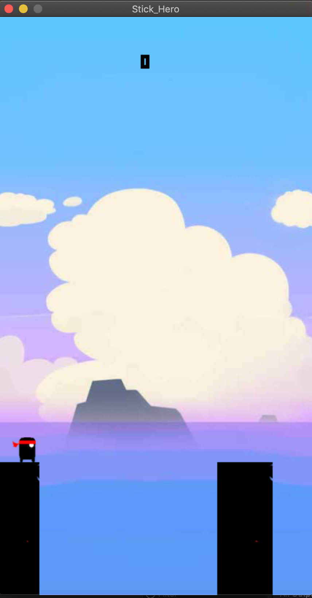

# Stick_Hero
Midas is a simple 2D-platformer game, written on C language using SDL.

### Description
Stick Hero is a bridge building game in which you must precisely stretch the stick to cross the platform gaps. The platform widths vary and the stick's length needs to be precise; the stick can't exceed the platform either because you will fall off... It takes a lot of practice to develop a good feeling of the correct length!

### Dependencies
This game requires [SDL2](https://www.libsdl.org) and [SDL2_image](https://www.libsdl.org/projects/SDL_image/) and
[SDL2_ttf](https://www.libsdl.org/projects/SDL_ttf/) installed

